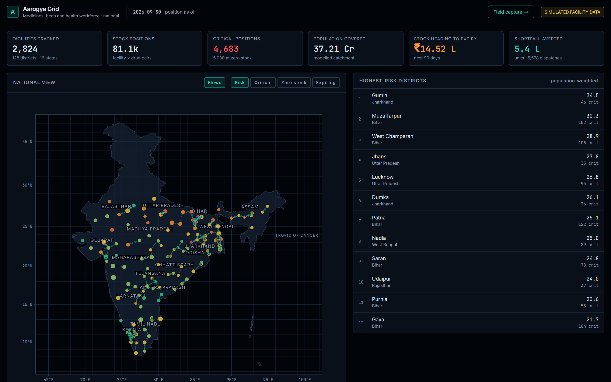

# Aarogya Grid

**A federated early-warning grid for India's primary health network.** It forecasts demand at every
facility–drug position — on Google's TimesFM wherever a held-out backtest says TimesFM wins — spots
outbreak surges days before a shelf empties, and moves medicine across district lines before it
does, without creating a stock-out anywhere else.

| | |
|---|---|
| **Live** | **<https://aarogya-grid-215071922486.asia-south1.run.app>** · Cloud Run, `asia-south1` |
| **Deck** | [docs/pitch-deck.pdf](docs/pitch-deck.pdf) ([source](docs/pitch-deck.html)) |
| **Defence pack** | [DEFENSE.md](DEFENSE.md) — the eight questions this build expects, each with one number and a file you can open |
| **Submission** | [SUBMISSION.md](SUBMISSION.md) — the description, what the brief asked for and where each clause is, and what was verified before submitting |
| **Demo video** | `npm run record:submission -- <url>` — a **3 min 32 s captioned take**, one continuous shot, driven against the live deployment. Script and real timings: [docs/demo-script.md](docs/demo-script.md) |
| **Built for** | Build with AI: Code for Communities — Second Edition, PS-03 *Smart Health & Supply Chain Resilience* |

*Verified on the deployed service, not only on a laptop: every route above renders in
**Chromium, Firefox, WebKit and an iPhone viewport** with a clean console
(`npm run rehearse:browsers -- <url>`), and the real-time loop closes through Cloud Run's load
balancer — **two open tabs updated 377 ms after a commit**, `X-Accel-Buffering: no` set, first SSE
frame flushed immediately (`npm run rehearse:live <url>`, which records the run in
[docs/live-gate.json](docs/live-gate.json)).*

### Try this in 60 seconds

1. Open the live console, **<https://aarogya-grid-215071922486.asia-south1.run.app/console>** (or the
   live link above, then **Open the live console**). The KPI strip is the whole country — every
   district of all 36 states and union territories:
   **12,010 facilities, 3,53,558 stock positions, 16,772 of them critical today.**
2. Scroll one screen to **Ask the grid** and press *"Where is it worst tonight?"* — or type your own,
   in English, Hindi or Hinglish. The **audit trail beside the answer** lists every tool that ran and
   every row it read. The model does no arithmetic; it chooses which rows answer the question.
3. Select **West Khasi Hills** in the highest-risk list beside the map, press **Open district
   console**, and scroll to the dispatch orders. Pick the Oral Rehydration Salts order from
   **CHC South West Khasi Hills-01**: two named batches with their expiry dates, a price for the
   vehicle that three more orders ride on for the cost of handling — and **Approve is disabled**,
   because the order crosses a district boundary and the donor district has to countersign first.

That is the whole argument: a forecast you can check, an instruction a storekeeper can execute, and a
governance rule the software actually enforces.



*Regenerate with `node scripts/capture-screens.mjs <baseUrl>` — screenshots are the one claim in a
submission that nothing checks, so these are taken from the running build rather than by hand. The
demo video is regenerated the same way: `npm run record:submission -- <url>` drives the whole
argument against the live service in one continuous take — a real Gemini call on real Hindi, a real
commit, a real ticket through approve → dispatch → receive-short — and writes
[docs/demo-script.md](docs/demo-script.md) with the timings that take actually has. The recording
itself is gitignored; regenerate it rather than trusting a copy.*

---

## The problem

A Primary Health Centre runs out of anti-snake venom in monsoon. The vials exist. They are ninety minutes
away, in a facility that will write them off unused in six weeks.

Nobody knows either fact, because the two facilities report into a paper register that reaches the district
office weeks later, if at all. India's public health supply chain does not primarily fail on procurement
volume. It fails on **visibility** and on **lateral movement** — the ability to see a shortage forming and
move stock sideways before it becomes a stock-out.

Aarogya Grid attacks both halves.

## What it does

**1. Sees the network — all of it.** A national control tower over 769 districts across all 36 states and
union territories — 12,010 facilities, 3,53,558 tracked facility × drug positions, 1,82,935 functional beds
and 1,73,109 sanctioned posts, across districts whose **2011 Census population** totals 121 crore: the
country. The district table is not typed in. `scripts/fetch-districts.mts` reads every row of the district
list, locates each district at its headquarters town, carries its real LGD district code where Wikidata has
one, and records where every field came from; 19 districts created too recently to have any published
population are listed and deliberately not modelled rather than given an invented one.

**2. Forecasts what will fail — on Google's TimesFM, where it measurably wins.** Demand is forecast
by **BigQuery `AI.FORECAST` (TimesFM 2.0)** in `asia-south1`. All **36,143** district × drug series are
forecast **21 days** ahead from a **90-day** context, in 13 concurrent statements and under two minutes of
wall clock; the model declined none of them.

It does not serve every position, and that is a measurement rather than a compromise. A **28-day
held-out backtest** scored TimesFM against the incumbent Croston per facility × drug, on demand
neither model had seen, using **MASE and RMSSE** (never MAPE — it divides by the actual, and
intermittent demand is full of zeros). TimesFM takes a demand class only where it beat Croston by
more than **5%** MASE. It won **intermittent** demand by 7.7% and holds **1,36,331** of the **3,53,558**
shipped positions; Croston keeps the rest. The full table, including where TimesFM loses, is in
[`docs/forecast-backtest.md`](docs/forecast-backtest.md).

Where TimesFM does serve, the two models split the work by strength. Demand at a *single* primary
health facility is *intermittent* — long runs of zeros punctuated by bursts — which is the regime a
foundation model trained on continuous series is worst at, and the regime **Croston's method** was
designed for. A *district* aggregate is smooth and seasonal, which is TimesFM's. So **TimesFM
forecasts the district mean path; a per-facility share disaggregates it; and Croston keeps the
occurrence process** — how often a facility sees any demand at all. That zero-inflation is what makes
the stock-out tail the right shape, and TimesFM does not model it. Stock-out probability and expected
shortfall still come from a **Monte Carlo simulation** over the procurement lead time, not a point
estimate, because "you will run out on the 14th" is a promise the data cannot support.

The forecasts are **committed to this repo** (`src/data/forecast-cache.json`), so cloning and building
reproduces the real TimesFM numbers with no Google Cloud account, and `AAROGYA_NO_BQ=1` builds a valid
snapshot from censored Croston alone with no network at all. `npm test` builds a district both ways —
with the forecast cache and without it — and checks each is byte-identical across runs; the full
offline national build is a manual check, not a suite.
Runtime and batching are measured in [`docs/forecast-runtime.md`](docs/forecast-runtime.md).

**3. Corrects for censored history.** A stock ledger records what was *dispensed*, not what was *needed*.
Once a facility hits zero, demand keeps arriving and stops being recorded. Fitting naively on that ledger
systematically under-forecasts exactly the facilities that are already failing — the worst-served districts.
The pipeline fits on the ledger with stocked-out periods excluded.

**4. Finds the stock that is already there.** The optimiser pairs facilities heading for a stock-out with
facilities heading for expiry, scoring each candidate transfer on averted shortfall weighted by **VED**
(Vital / Essential / Desirable) class, waste averted, and transport cost. Every recommendation names the
**specific batch and its expiry date** — a recommendation a storekeeper cannot act on is not a recommendation.

**Stock crosses district lines, and a route is priced once.** These are one change, not two. An earlier
build planned each district in isolation and charged every order its own dedicated vehicle, and not one
order crossed a boundary. A cross-district trip is longer, so it fails the same benefit/cost gate harder
and could never have been afforded on its own; it becomes viable only once orders sharing a route share
the vehicle. Measured when the change landed, on the 128-district grid this project started with, it
bought **19% more shortfall averted** — 495,166 → 5,89,873 units — from the same stock.

Across the whole country the plan is **23,070** dispatch orders on **9,421 vehicle trips**, of which
**6,415 trips reach into another district**, carrying **15,930 orders** over
**2,348 district-to-district corridors** touching **763 of the 769 districts** — **284** of those corridors
also crossing a state line.
Transport comes to **₹125.9 L** against **₹277.0 L** if each order were billed its own vehicle, and
**11,279** orders are filled for the price of handling because a vehicle was already going. The plan averts
34,39,003 units of shortfall for a net cash cost of **₹107.0 L**.

One consequence is worth stating because it is the kind of thing that hides: a cold-chain order joining an
ambient run refrigerates the *whole* vehicle. The gate that admits ride-alongs was charging such an order
₹60 of handling while it actually cost ₹60 plus the upgrade — 238 trips and ₹1.82 L of vehicle, about 4.8%
of the transport budget, admitted against a test they had not passed. The rupees were always counted in the
totals; they were not counted in the *decision*. The upgrade is now priced into the gate and billed to the
order that causes it. When that landed (on the 128-district grid), the plan carried 184 fewer orders, cost
₹1.53 L less to run, and scored *higher* — which is what removing orders whose cost exceeded their benefit
is supposed to do. In the shipped national plan, **353** cold-chain orders ride an open trip and **170** of them
are the order that puts the cold box on the vehicle, paying **₹1,17,204** of upgrade between them; every
other cold rider joins a run that was already refrigerated.

**4a. And it never empties one shelf to fill another — which is now a test, not a sentence.**
A redistribution planner that fixes a stock-out by creating one has done the only unforgivable thing
in this problem domain, and every system of this kind claims it does not. Three limits, and the
third is the one that matters:

| | |
|---|---|
| No donor gives away more than | **40%** of what is physically on its shelf |
| Every donor keeps at least | **21 / 14 / 7 days** of cover (Vital / Essential / Desirable) — the simulator's own safety days |
| After giving, a donor's stock-out probability must be | **≤ 10%**, and no more than **2 percentage points** above where it started |

The third is enforced **inside the selection loop**, not audited after the plan is built. The donor's
own lead-time demand is simulated at the stock the order would leave it holding — cumulatively across
every order and every pass — and a candidate that pushes it past its guardrail is never considered.
A guardrail checked afterwards can only report a violation; one checked before admission cannot
produce one.

`npm test` re-derives it from the other end. `scripts/verify-guardrails.mts` takes the finished plan,
adds up everything each donor gave, **redraws that donor's distribution from an independent seed** — dice
the planner never saw — and fails on any breach beyond one simulation in 2,000, which is the resolution
of the draw and nothing more. Measured over six district plans drawn across the country:
**230 donor positions**, worst post-donation stock-out risk **2.4%**, largest rise **1.9 percentage points**. The
same script re-plans the busiest of them with the caps lifted so the guardrail cannot be decorative:
Howrah's plan falls from **108 orders to 96** with the caps on, and the worst donor it leaves behind
improves from **6.8% to 1.4%** stock-out risk. Those 12 orders are the price, and it is a price this
project pays on purpose.

An independent draw catches a plan that only satisfies its guardrail against one sample vector. It
cannot catch a sampler that is biased for everyone, so that is guarded from the other side:
`scripts/test-timesfm.mts` requires the Monte Carlo's mean to equal the demand the risk record
publishes, for every Croston method and every seasonal profile. That test exists because the two had
diverged — seasonal smooth drugs were simulated at roughly half their published demand, so a Lucknow
paracetamol row reported 6.3 days of cover against a 10-day lead time *and* a 5.8% stock-out risk. With
the sampler fixed, the same row reported 97%.

**4a2. And it will not propose an order nobody has the authority to issue.** The optimiser is very
good at finding the cheapest vial within 150 km. It has no idea the vial belongs to a different state
government, sits on a different budget head, and cannot be signed out by the officer reading the
screen. So every movement is classified before it is priced:

| Movement | Verdict |
|---|---|
| Inside one district | the district officer issues it |
| Across a district, inside one state | **needs the donor district to countersign** |
| Across a state line, CHC tier and above | **needs an inter-state supply agreement** |
| Across a state line, below CHC | **refused — no procedure exists** |

The last row is the honest one. This build previously planned sub-centre-to-sub-centre movements
across state lines and showed them next to same-block transfers as though they were the same kind of
thing; an ANM cannot requisition stock from another state's ANM under any procedure that exists.
**The gate is not cosmetic and it is not free**: when it landed on the 128-district grid, cross-state
corridors fell from 74 to 29, and the plan went from 7,097 orders to 5,578 with the donor guardrails
applied alongside it. Only **149** needs end up declined as administratively impossible across all 769
districts, because a need refused across a state line is usually served from inside it — the gate
removes *orders*, not *services*.

And it reaches the ticket. `POST /api/dispatch` refuses `approve` on a cross-boundary order with a
**409 and the action that unblocks it** until a `countersign` row exists in the same append-only
history as everything else, so "who allowed this" is answered by the audit trail rather than by a
policy document nobody can produce afterwards. The console disables Approve and says which
instrument is missing, because an officer told "no" and not told what unblocks it works around the
system rather than through it.

**4b. Closes the loop in real time.** A health worker speaks or photographs a stock report, a human
confirms it, and **the risk board changes within a second — in every open tab, without a reload**.
`POST /api/commit` resolves the drug **by name, server-side** (never a client-supplied `drugId`, and
never the draft's own status — the draft came from a language model), re-scores that position
synchronously, and pushes the delta over **Server-Sent Events**.

Measured end to end by `npm run rehearse:live`, in a real browser, **against the live Cloud Run
deployment**: **server-side re-score 14 ms** (budget 100 ms) and **377 ms to reach two open tabs**
(budget 2 s). The first commit a cold container sees costs 82 ms rather than 14 — module
initialisation, reported by the rehearsal rather than averaged away. These are one run's figures,
and the run that took them is recorded in [docs/live-gate.json](docs/live-gate.json): an earlier
build quoted this loop with two different figures forty lines apart and no record of either, so a
passing rehearsal now writes the artefact and `npm test` reads every surface against it.

The part that is easy to get wrong is the reload. `/console` and every `/district/[code]` page render
from the **batch run**, not from the live overlay, so a committed report is never in the HTML the server
returns.
Subscribing to SSE alone produces a demo that works beautifully until somebody presses F5 and every
change vanishes. So both consoles **fetch `/api/overlay` on mount AND subscribe to the stream** — the
fetch supplies the past, the stream supplies the future — and the rehearsal reloads the page and
asserts the change is still there.

**And it survives the container being replaced.** Every committed event is appended to a partitioned
BigQuery table (`aarogya_grid.stock_events`) and published to a Pub/Sub topic (`aarogya-events`); a
restarted container reads the log back before it serves its first request. `npm run rehearse:restart`
starts a production server, commits, **kills the process**, starts another, and opens a real browser
against the replacement — which renders the corrected number off a page whose batch data predates the
report. The append is acknowledged in well under a second and the restore query in a couple of
seconds; the exact figures, for both a killed local process and a replaced Cloud Run revision, are in
[docs/restart-gate.md](docs/restart-gate.md), written by the gate itself. The sequence resumes from the
log rather than from zero, so an SSE client that reconnects with `Last-Event-ID` is still asking for
the same thing it was before.

The durable write is deliberately **not** on the commit's critical path. The recompute takes ~15 ms and
the append a few hundred; awaiting it would make a health worker on a district hospital's wifi wait
twenty times longer for the same answer, and would let a busy warehouse in another region fail a report
that is already correct. So each event reports its own state — `pending` on the way out, then
`durable` or `failed` over the stream a moment later — and the chip on screen says which. A failed
append never fails a commit.

Honest limits, still stated rather than implied: the in-memory overlay is not shared between instances,
so the service runs `--max-instances=1` — a commit landing on one container would otherwise be invisible
to a stream held open on another. The scale-out step is a **subscriber** on the topic the commit path
already publishes to, and that subscriber is not built: with one instance it would be dead code behind a
flag nobody flips before 30 September. `npm run verify:pubsub` proves the publish side by pulling the
messages back off a real subscription.

**4b. And the loop closes: approve → dispatch → receive.** The planner produces dispatch orders and the
console prints them. That is where a recommendation engine stops, and it is why so many systems of this
shape are called dashboards: nothing that happens afterwards ever comes back. Every order card now
carries a ticket —

    proposed ──approve──▶ approved ──dispatch──▶ dispatched ──receive──▶ received
       │                     │
       └──────cancel─────────┴──▶ cancelled

— and **the log of its transitions is the audit trail**. There is no companion table of current ticket
states, because an append-only log plus a mutable projection is two records of one event, and the day
they disagree neither is evidence. A ticket's state is the fold of its rows in `dispatch_tickets`, so a
restarted container rebuilds it by replaying, and a ticket that was mid-flight when the process died
needs no special case.

**Approval moves no stock.** Stock leaves the donor when it is *dispatched* and arrives when it is
*received*; in between it is on a vehicle and on nobody's shelf. Writing both at approval is the obvious
simplification and it would show the same units in two places for the length of the journey — which is
exactly the error the paper process makes and exactly what a real-time view is for. So approval re-scores
both ends as **projections**, labelled as such on the card, and the two real movements write into the
same overlay a voice report writes into.

**The short receipt is first-class.** The receipt field takes what actually arrived, the difference is
kept as `varianceUnits`, and the receiver's risk recovers by what turned up rather than by what was
sent. Measured in `npm run rehearse:dispatch`, on a cross-district ARV order: approval projected the
receiver from **P(out) 100% → 2%** at 14 vials; 14 were dispatched, **11 arrived**, and the receiver
landed at **17%**. Both numbers are on the card. An interface that made the honest answer harder to
enter than the convenient one would produce a dataset in which nothing ever goes missing.

Illegal transitions are **409 with the legal actions attached**, never a quiet 200 — a second approve is
almost always a double submit or a stale tab, and answering 200 teaches the client that its retry worked.
Quantities are arithmetic rather than policy: a donor cannot send what it does not hold, and more cannot
arrive than was sent (the fix for that is the dispatch note, not the receipt). The order itself — donor,
drug, planned quantity — is read from the district payload **server-side**; the client supplies an id, an
action, and at most a smaller number of units. There is no authentication in this build, so the actor is
recorded as `actor_claimed`, which is what it is.

`GET /api/dispatch/export?districtCode=…` returns the plan as a **batch-wise stock-issue CSV** — indent
number, both facilities, item, batch, expiry, and three separate quantity columns for indented, issued
and received. One row per batch, because that is how a storekeeper picks and how expiry is tracked; a
short issue comes off the batches in pick order, so the shortfall lands where it physically landed.
That file is the difference between a dashboard and something a district could pilot next month: this is
a decision layer over DVDMS and e-Aushadhi, not a replacement for them.

**4c. Watches for the emergency, and says out loud how often it is wrong.** A stock-out is a lagging
indicator: by the time a block's anti-malarials run short, the malaria has been there a fortnight, because
consumption cannot move until people have already walked in and been treated. So there is a second series
— **outpatient footfall**, 16,31,014 consultations on the as-of date, modelled per facility and **censored by the
same roster the workforce panel shows**. An OPD with no clinician present does not run at reduced quality;
it does not run, and the register for that day is thin. That is the third appearance of one idea in this
codebase — a stock ledger cannot record a dispensation that had no stock, an occupancy return cannot record
a patient who was not admitted, an OPD register cannot record a consultation nobody was there to give.

**BigQuery `AI.DETECT_ANOMALIES`** runs over both district series, through the same inline-subquery encoder
the forecast uses: 36,912 series in 32 statements, **0 bytes processed and 0 billed**, 0 series declined.
It flagged 515 of 769 districts on footfall alone — which is **not a broken detector**. At the 0.95
threshold over 28 scored days, 1.4 flagged points per series is what chance predicts, so most series have
one. A product that called each of those an outbreak would be useless in the way every "AI anomaly
detection" dashboard is useless.

So a warning is a **rule over points**, and the rule was chosen by measurement rather than by taste.
`npm run tune:warning` injects surges into the real series of a 128-district panel drawn from all 36 states
and union territories — 126 surges, three rounds, 14 days each with a 4-day ramp, at 1.5×/2×/3× on three
epidemiological patterns — runs the real detector, and scores **80 candidate
rules** (20 thresholds on each of 4 signal sources) against 258 clean district-observations. The panel is the
size of the grid the experiment was designed on, because the precision it reports depends on the share of
districts with an outbreak, and the tuned rule is then applied to all 769. The published result:

| | |
|---|---|
| Rule | 2 consecutive days above the model's upper bound by ≥ 10%, on district drug consumption |
| Detection of a 2× 14-day surge | **100%** |
| Median lead before the first shelf empties | **4.58 days** |
| False alarms per district-week | **0.446** |
| Precision | **21%** |

**21% precision is not a good number and it is published anyway**, next to the **78 rules that failed**, in
[docs/warning-tuning.md](docs/warning-tuning.md). Two tighter rules reach 53% and 42% precision and miss the
gate only on the four-day lead; moving the gate after seeing the table would turn every number on the page
into an argument. The table also records the measurement that inverted the obvious expectation: **footfall is
upstream and nearly blind at district scale.** An outbreak doubles one disease, and vector-borne illness is
about 9% of a district's outpatient load — so a 2× surge arrives in total OPD as ×1.09, while the drugs that
treat it double. Watching both was right; assuming the upstream series would win was not.

**A surge is a policy question, not only a demand question.** `simulate_outbreak` re-scores a district and
its donor cluster at a raised caseload and plans twice — once at routine valuation of a stock-out and once at
emergency valuation (₹100 per averted Vital unit against ₹25). On a doubled vector-borne caseload in Purnia
that is *6 of 78 surge needs servable at routine valuation, 17 at emergency, for ₹14,867 more transport*.
Raising demand alone would have produced a wall of benefit/cost refusals, which is the measured behaviour of
this system under load; what changes the answer is the **price of a stock-out**, which is a ministry dial and
is reported next to its effect rather than baked in. It returns in **under 4 seconds** and is deliberately
**not** in the assistant's default tool set — a tool the model can see is a tool it will call, and half a
second of CPU on every question would end the p50-under-8-seconds budget.

**The warnings leave the building in a shape somebody else can read.** `GET /api/indicators` serves a
country-agnostic early-warning feed — 1,822 signals — whose required fields carry no Indian vocabulary at all:
an area has a code, a *named code system*, a name and a population; a signal has a hazard class from a fixed
list, an observed value, an expected range and a confidence. Every district code and medicine id travels in
an optional `local` block a consumer can drop. It validates against
[docs/indicator-schema.json](docs/indicator-schema.json), which is emitted from the same definition that
builds it, and `npm test` strips every `local` block and re-validates — so the interoperability claim is
checked rather than asserted. The feed carries its own `method.validation` block (the four numbers above)
and a required `disclosure` saying the caseload behind it is **simulated**: a surveillance exchange that did
not state its provenance would invite a consumer to treat a simulation as a case count, and there would be no
way to discover that downstream. That is the BRICS Integrated Early Warning System hook, built as a contract
rather than as a slide.

**4d. Shares models across states, not data.** The brief asks for *federated* and for *shared
predictive modelling across states*, and both are easy to write and hard to check. So each of the
**36 states is a node that fits its own model on its own data** — every state and union territory — and
publishes **statistics only**: a monthly demand multiplier for each of 47 catalogue items, the days of
evidence behind it, its standard error, two anomaly baselines, and one vacancy rate per cadre.
**56,660 numbers** leave the states in total, about **1,574 each**, against **65,05,740** daily
consumption records that stay where they were recorded. **0 facility rows, 0 stock quantities, 0 patient records and 0
district identifiers** cross a state line — and that is enforced rather than promised: every field
in a node file is on an allowlist, every count is pinned to a structural identity, and `npm test`
sweeps all 36 files for facility ids, district codes, batch numbers and names. The sweep first
runs over five **deliberately poisoned** copies and fails if it misses any of them, because a
leakage test that has never rejected anything is not a test.

The nodes are pooled into a national prior by **random effects, with the between-state variance
estimated from the nodes** rather than chosen. A state therefore keeps its own estimate exactly to
the extent its own data earns it: across the thirty-six, between **1.7% and 33.7%** — the least for
Chandigarh, whose single district says little the country does not already know, the most for Uttar
Pradesh, whose seventy-five say a great deal. A month a state has
never observed carries no standard error, gets weight zero, and receives the national multiplier
outright — which is what a state joining the grid should get on its first day. The identical function
pools cadre vacancy rates, so the mechanism is one mechanism and not a seasonal-index helper with an
ambitious name.

**What that is worth is measured, leave-one-state-out.** A state is re-fitted on only its first
**30 days** of history and forecasts the remaining 150; the prior it is offered is pooled from **the
other thirty-five states and union territories only**, so none of its own data can come back to it
disguised as a prior. Scored over 21-day planning blocks on **35,836** district × drug series, it lands
**36.0% closer** to observed demand than forecasting alone and **36.9% closer** than assuming demand has no
season — recovering **97% of the gap** to a full-history fit of itself. The gain is **63%** on antibiotics and **58%** on
antimalarials, and **about zero** on chronic-care drugs whose demand genuinely has no season, which is
the correct answer there. On **Antidotes it is −6.0%**: anti-snake venom moves at a fraction of a vial
a district-day, its observed seasonality is far flatter than its true one, and sharing a shape nobody
can measure well does not help. That row is published rather than dropped.

**Every node is a URL.** `GET /api/federated` returns the prior, the estimator, the disclosure and the
**SHA-256 of all 36 node files**; `GET /api/federated/10` returns Bihar's file byte for byte, so
`curl … | sha256sum` can be compared against the digest in the index and against the file committed in
this repository. The method and the full tables are in [docs/federated.md](docs/federated.md).

**The limitation is on the panel, not in a footnote.** One seeded simulator generates all thirty-six
states and union territories, so genuine between-state heterogeneity is small by construction: the
pooling weights are a demonstration of a mechanism, and the prior transfers better here than it would
between thirty-six real health systems. What is not a demonstration is the partition, the estimator, the leave-one-state-out
protocol, and the fact that the published artefact has no field a facility row could travel in.

**5. Tracks the other two resources the network runs on.** Medicines are one of three things a facility can
run out of. **Bed availability** is modelled per IPHS norms with ward-level seasonality; **personnel
attendance** is modelled as *sanctioned* vs *in-position* vs *present-today*, because in rural India the
vacancy gap and the absence gap are different problems and the distance between those three numbers is the
finding.

They are not three dashboards on one page. They are one system, and the hinge is this: **918 stock-holding
facilities have no pharmacist in position to keep the register, and 1,568 facilities covering 3.27 crore
people carry stock figures nobody is in post to verify.** That does not rewrite any measured quantity — it
widens the forecast error bar around it.

**6. Closes the last mile with Gemini.** The upstream data problem is that an ANM at a sub-centre reports
stock on paper, in Hindi, using words like *"bukhar ki goli"* and brand names like Crocin and Dolo. Nothing
in a catalogue matches that. Gemini handles transcription, translation and extraction from **speech or a
photographed paper register**.

**7. Lets a District Health Officer interrogate all of it, in their own language.** `askGrid` and
`briefDistrict` give Gemini a **function-calling tool surface over the computed state**. The officer asks
*"Bastar mein kaun se centre par dawa khatam hone wali hai?"*; the model plans which tools to call, calls
them, and answers only from what they return. The **tool-call trace is shown in the UI**, because a
grounded answer nobody can check is indistinguishable from a confident guess.

It also has to be fast enough to be used. `npm run rehearse:assistant` puts five real questions —
two in the shape an officer asks, one in Hinglish, one national, one deliberately unanswerable —
through the real model against the real payloads, and reports the distribution rather than a mean.
The first measurement was a **median of 20.2 seconds**, with the two slowest runs spending all six
turns making six tool calls one at a time. Three changes — a **minimal thinking level**, **four turns
instead of six**, and an instruction to ask for every tool it needs in one turn — bring that to a
**median of 5.1 seconds**, with all five answers still grounded in a tool result. The figures are
written by the script that took them, in
[docs/assistant-latency.json](docs/assistant-latency.json).

The slowest of the five is **11.2 seconds** and it is over the budget, which is worth saying rather
than hiding behind the median. It is the national question with no district open — *"which facilities
are about to run out of a vital medicine, and what should I move?"* — and it fans out to **ten tool
calls across eight states**, each one a real lookup over a real payload. That question was also the
one that found a bug: mounted on `/console` with no district open, every district-scoped tool refused
for want of a district and the model correctly concluded it could not answer. `list_positions` now
answers from the national alert board when no district is given.

Every dispatch order the assistant quotes carries **who is allowed to issue it** and **what it leaves
the donor holding**. An officer told to move 1,746 sachets from the next district, and not told that
the next district has to countersign first, finds out at the worst possible moment.

The answer is rendered as the **Markdown it actually is**. The model returns `###` headings,
numbered lists and `**bold**` facility names; until this build they were printed raw, so the one
screen in the product whose whole job is to be legible to somebody who is not an engineer was showing
them asterisks. It is rendered by forty lines of React that emit elements and never HTML — there is
no `dangerouslySetInnerHTML` anywhere near model output.

## How Google AI is used — and how it is bounded

Gemini does the part only a language model can do, and is deliberately trusted with nothing else:

| Safeguard | Why |
|---|---|
| **The model never emits catalogue IDs.** It returns natural-language drug names only; mapping names → IDs is deterministic (`src/lib/ai/resolve.ts`). | A hallucinated item code can never enter the ledger. |
| **Structured output is enforced twice** — a Gemini response schema constrains generation, and Zod validates the result before it goes anywhere. | The schema steers the model; Zod is what we actually trust. |
| **Nothing is committed.** Every capture produces a *draft* for human confirmation. | Implausible quantities, unit mismatches, and drugs outside the facility's formulary are flagged, not silently accepted. |
| **The formulary bounds the tier.** A Sub-Centre cannot report Ceftriaxone. | The system refuses rather than trusting the transcript. |

The resolver handles Hindi colloquialisms (*saap kaatne ka injection* → Anti-Snake Venom, *lal goli* → IFA),
brand names, and misspellings — while correctly distinguishing **cetirizine** from **ceftriaxone**, which are
one edit apart and clinically unrelated. See `scripts/test-resolve.mts` (27 assertions).

### The agent loop is hand-written, deliberately

The SDK offers automatic function calling. We don't use it. The loop is written by hand so that we can
reject any tool name not in the registry, Zod-validate every argument before it reaches real data, cap the
number of turns, and **record the trace ourselves rather than asking the model what it did**. Automatic
calling provides none of that and hides all of it.

That last point is not paranoia. Asked about a district it had not been given, the model invented the
district code `"Lucknow"`; asked to self-report its tool usage, it invented a namespace prefix that does not
exist. So the model is never given an identifier to emit — tool arguments are natural-language names,
resolved deterministically inside the tool, exactly as `resolve.ts` does for drugs.

**12 tools** are registered and eleven are in front of the model on every question, all pure reads
over already-computed data: `resolve_district`, `national_overview`, `district_status`,
`facility_snapshot`, `list_positions`, `list_dispatch_orders`, `cross_district_flows`,
`explain_forecast`, `explain_unmet_need`, `drug_reference` and `early_warnings`. The twelfth,
`simulate_outbreak`, is offered only when the caller asks for a scenario, because it is not a read: it
re-scores a district cluster and runs the planner twice, about half a second of CPU against an
eight-second budget.

Adversarial testing (`scripts/test-agent.mts`) found and fixed two real defects: the model was **computing**
percentages from raw probabilities (`0.998` → "99.8%") — faithful arithmetic, but a violation of the rule
that it may never manipulate a quantity, now fixed by giving every ratio a precomputed percent companion to
quote; and Hindi was not being honoured under the weight of English tool payloads. The suite audits every
numeric token in the model's prose against the tool payloads it actually saw, and **proves the audit can
fail** by tampering a known-good answer.

Models are configuration, not constants: `GEMINI_MODEL` for the agent, `GEMINI_MODEL_FAST` for capture
and for the agent's retry when the primary's daily allowance is spent or the primary is unavailable (a
503 or an internal error). A per-minute throttle is not a reason to change models, so it waits the delay
the API asks for and retries the same one. The deployed service runs
**`gemini-3.5-flash`** with **`gemini-2.5-flash`** behind it — the only two Gemini models Vertex serves in
`asia-south1`, which is verified by probing rather than assumed. Set both in `.env.local`; the code
default for both is `gemini-2.5-flash`, because no `-lite` variant is served in `asia-south1`.

### Backends

Two, selected automatically. The **Gemini API** path uses `GEMINI_API_KEY`. The **Vertex AI** path is used
when `GOOGLE_CLOUD_PROJECT` is set and there is no key to fall back on (or `GOOGLE_GENAI_USE_VERTEXAI=true`
forces it), and pins inference to **`asia-south1`** rather than the SDK's `us-central1` default — because
the first question a state health department's IT cell asks about a system touching facility-level data is
which jurisdiction it is processed in. On Cloud Run with a service account, the credential stops being a
string in an environment variable and becomes an IAM identity that can be rotated, audited and scoped.

The selection is deliberately *not* "Vertex if a project id exists" — a project id in an env file is not
evidence that Application Default Credentials are configured, and flipping on its presence would break
every call at the first inference attempt.

## Data provenance — what is real and what is not

This is stated plainly because a judge will ask, and because the honest answer is a strength.

**Real:** every district, its state, its headquarters town and its LGD code where Wikidata carries one;
**district populations, from the 2011 Census**; the facility tier structure and bed norms (IPHS 2022); the
sanctioned staffing establishment by tier (IPHS 2022); the catalogue of 46 drugs from India's **National List
of Essential Medicines** plus one tracked consumable, with VED classification, pack units, cold-chain flags
and indicative unit costs.

**Anchored to real data, but modelled:** how many facilities each district has, and how reliable its supply
is. Facility counts are scaled by population against a fixed reference district of 2.9 million people, so a
district's network never depends on which other districts happen to be modelled. Supply reliability is
anchored to each state's **NFHS-5 institutional births rate**, read from The DHS Program's API — the
survey's own publisher — a measure of whether a state's health system reaches people. It is a **proxy**: it
is not a measurement of whether consignments arrive complete and on time, and nobody publishes that, which
is the problem this product exists to address.

**Simulated:** the stock ledger, bed occupancy and staff attendance. All are generated by a seeded,
deterministic simulator parameterised from IPHS norms and published epidemiological seasonality. None of it
is **fitted to observed data**. Vacancy and absence rates are shaped by the published literature but are
modelling assumptions, not measurements of any real district.

### Four things a careful reader will check, so they are stated here

**District populations are the 2011 Census apportioned to CURRENT boundaries.** Where a district has been
split since 2011, our figure is therefore *smaller* than the "Census 2011" number a search returns: Bastar
is 834,873 in the source table, while undivided 2011 Bastar — before Kondagaon was carved out of it — was
1,413,199. We model today's districts, so today's territory is the right denominator.

**The first version of this table got that exact example wrong.** The source's rows carry footnotes like
"Kondagaon district was created in 2012 after bifurcation of [[Bastar district]]", and the old parser took a
row's first link as its district — so Kondagaon's population was filed under Bastar, and this README quoted
"our Bastar is 578,326" as its worked example of apportionment. It was Kondagaon's number. Dantewada,
Bilaspur and Raipur were caught by the same trap. The registry now reads rows by column, and
`scripts/verify-census.mts` checks it three independent ways: every state's districts add up to that state's
2011 Census total, 640 of 702 census-vintage districts agree with Wikidata's own 2011 figure within 2%, and
the ten districts in an independent capture whose boundaries are unchanged agree to within **0.14%**.

**The source double-counts, and the correction is visible.** The district table lists a district carved out
after 2011 and does not always subtract it from its parent, so Ladakh's districts came to 152% of Ladakh's
census total and Nagaland's to 131%. Which parent kept which child is not machine-readable for most states,
so the correction is made where a total is published: a state whose districts exceed its 2011 Census total is
scaled to it, and every district records the table's figure and the factor. Andhra Pradesh's table carries
the state's own 2021 estimates, and those are labelled as estimates rather than as census counts.

**District risk rankings are no longer arbitrary.** Supply reliability used to be a hash of the district
code, which ranked Kerala below Chhattisgarh because a hash has no opinion about Kerala. The worst eight
districts are now in Nagaland, Meghalaya, Jharkhand, Arunachal Pradesh and Bihar, and Kerala's worst district ranks
136th of 769 by mean risk — because the anchoring indicator says so, not because we decided it should. That
indicator was itself wrong until this build: the table it came from carried NFHS-4 values under an NFHS-5
heading, putting Bihar at 63.8% and Jharkhand at 61.9% where the survey reports 76.2% and 75.8%.

We do not have access to DVDMS / e-Aushadhi. `src/lib/pipeline.ts` is the seam where a real deployment swaps
in real data: everything downstream consumes `FacilityDrugState`, so nothing below the seam moves. Above it,
**three adapters** change — `generateNetwork` (`src/lib/sim/facilities.ts`) becomes an ABDM Health Facility
Registry pull, `simulateInventory` (`src/lib/sim/inventory.ts`) becomes a DVDMS stock extract, and
`buildResourceStates` (`src/lib/sim/resources.ts`) becomes an HMIS bed and attendance feed. The pipeline that
calls them, the forecaster, the risk model, the optimiser, the snapshot and every screen are untouched.

It used to say "one file and nothing else". That was the wiring file, not the adapters — the kind of claim
that is impressive until someone opens the directory, which is why `scripts/check-claims.mts` now counts
them.

## Running it

```bash
npm install
cp .env.example .env.local     # add GEMINI_API_KEY from https://aistudio.google.com/app/apikey
npm run dev                    # http://localhost:3000
```

The forecasting and redistribution core runs **without** an API key — only voice and register capture are
disabled. That is deliberate: a demo that dies on a missing env var is a demo that dies on stage.

### Scripts

Scripts are `.mts` (not `.ts`) because `tsx` compiles `.ts` as CommonJS in a package without
`"type": "module"`, which breaks top-level `await`.

```bash
npx tsx scripts/pipeline.mts           # every artefact, regenerated in dependency order
npx tsx scripts/fetch-districts.mts    # re-read the district registry from its sources (network)
npx tsx scripts/build-snapshot.mts     # rebuild the national snapshot (900-1,300 s for the country)
npx tsx scripts/demo-district.mts DST-22-BASTAR
npx tsx scripts/test-resolve.mts       # drug entity resolution, 27 assertions
npx tsx scripts/test-capture.mts       # capture validation, 26 assertions
npx tsx scripts/test-agent.mts         # grid agent: live tool calls + number audit (spends quota)
npx tsx scripts/eval-censoring.mts     # measures the censoring correction; writes src/data/censoring-eval.json
npx tsx scripts/list-models.mts        # which Gemini models your key can reach
npx tsx scripts/build-federated.mts    # refit the 36 state nodes, the prior and the measured table
npx tsx scripts/verify-federated.mts   # the leakage sweep (also in npm test)
```

### The gate, and the one test a unit test cannot replace

```bash
node .claude/scripts/verify.mjs        # lint, types, test suites, build, live/repo parity
npm test                               # the suites on their own
npm run rehearse:voice                 # the Hindi voice path, end to end, in a real browser
npm run rehearse:live                  # commit -> SSE -> two tabs -> reload (needs a server)
npm run rehearse:restart               # commit -> KILL the process -> restart -> still there
npm run rehearse:dispatch              # approve -> dispatch -> receive short, in a browser
npm run verify:pubsub                  # pull the committed events back off the topic
npm run record:demo                    # the whole loop, one take, to docs/demo/*.webm
npm run anomalies:detect               # AI.DETECT_ANOMALIES over both district series
npm run tune:warning                   # inject surges, score 80 rules, publish the table
npm run export:indicators              # build the feed and validate it against its schema
```

`verify.mjs` prints one table and treats `SKIPPED` as not green. Its last step asks the **deployed**
service whether it agrees with the committed snapshot, because every other step can pass while the
thing being evaluated is a different build.

`rehearse:voice` is the interesting one. It drives the real `/capture` page in a real browser —
`getUserMedia` → `MediaRecorder` → `onstop` → base64 → the 6 MB proxy ceiling → Gemini → Zod → the
drug resolver → the rendered draft. The only thing substituted is the microphone hardware: a
committed 113 KB fixture of Hindi speech is played through Web Audio, so anyone who clones this repo
can reproduce the run with no microphone and no TTS credentials.

It exists because the audio path once did `btoa(String.fromCharCode(...))`, which throws past
~100 KB — about **nine seconds** of Opus — inside a handler nothing awaits. No request, no error, no
spinner. The printed Hindi sample takes twelve seconds to read, so the flagship demo failed silently
for anyone who spoke a full sentence, and passed every test that spoke one word. The rehearsal
therefore asserts that the request body **exceeds what the old encoder could have produced**, or the
run proves nothing about the bug it exists to catch.

Measured against the live deployment: 14.3 s of Hindi, a 261,534-byte body, HTTP 200 in 9.8 s, and
four entries resolved — including *लाल गोली* ("red pill") to Iron + Folic Acid, and *बिल्कुल खत्म*
("completely finished") to a stock level of zero rather than a missing row.

## Architecture

```
src/lib/domain/      drug catalogue (NLEM), Indian geography, facility tiers, bed + staff norms
src/lib/sim/         inventory, facility and resource simulators  <- swap for DVDMS/HFR extract
src/lib/forecast/    Croston, seasonality, Monte Carlo risk
src/lib/optimize/    redistribution optimiser
src/lib/ai/          Gemini client, schemas, deterministic resolution, grid agent + tool surface
src/lib/pipeline.ts  the seam: facilities -> ledger -> demand fit -> risk -> transfers
scripts/             batch jobs and evaluation harnesses
src/app/             national console, district console, capture console, /api/ask
```

Evaluating one district — a year of ledger across hundreds of stock positions, a demand fit and Monte Carlo
risk on each — takes seconds. Doing that for 769 districts on a page load would make the national view
unusable, so the national roll-up is a **precomputed batch artefact** and every page reads the batch run the
service is serving (`src/lib/run-store.ts`), parsed once and held in memory. That is also how it works against
real data: a nightly job writes the national picture off an HMIS extract. The UI has no idea where the
numbers came from.

## Scaling across India

The expensive stages — network generation, 365 days of ledger, the censored fit and the Monte Carlo risk
evaluation — are district-parallel with no shared state. Each is seeded on `(seed, facility, drug)`, so a
district computes byte-identically whether it runs alone or alongside every other, on any thread.

**Planning is not district-parallel, and it cannot be.** Donor stock is a physical quantity that can be
promised exactly once, so cross-district planning shares one allocation state across the whole country — the
shipped plan has 284 cross-state corridors, so that state does not even stop at a state line — and it is
order-dependent by construction — a district planned earlier gets first refusal on stock it shares with
a later one. What it can be is parallel **where no stock is shared**. Two districts whose clusters (the
district and its four nearest neighbours) have no district in common read and write disjoint parts of the
planner state — every key begins with a facility id, and every facility id with its district code — so their
plans are independent of which is computed first. `scripts/build-snapshot.mts` colours the table into rounds
of mutually disjoint clusters and runs each round on every worker thread at once: **10 rounds**, the largest
106 districts, rather than 769 tasks in a line. The order is fixed, so the result is deterministic; it is
simply not symmetric, and the round count ships in the snapshot's `batch` block rather than in a sentence
nobody re-derives.

The national batch takes **900-1,300 s** on one laptop: 953 s on five threads for a Croston-only run, 1,020 s
on four for the shipped TimesFM run, which records its own wall clock and thread count in `buildSeconds` and
`batch`. The thread count is derived from free memory, not from cores — each thread holds its cluster's
simulated districts — and that was learnt the expensive way: the first run started twelve threads on a
laptop with four gigabytes free, paged, and ran slower than one thread. Windows also parks a background
process's threads on efficiency cores, so the batch asks for above-normal priority.

**The guardrails roughly doubled the batch, and that is worth naming rather than absorbing.** Checking
that a candidate transfer would not expose its donor means simulating that donor's own lead-time demand,
thousands of extra Monte Carlo runs per district. It buys the one property this planner cannot ship
without, it is a batch job nobody waits on, and the alternative — auditing the guardrail after the plan is
built — would cost the same arithmetic and produce a violation instead of preventing one. Most of that time
was then won back somewhere unglamorous: the simulator formatted the same 365 date strings for every
position simulation, and the reorder point sorted 600 samples to read one of them.

The demo runs at a reduced facility density (2 CHC / 6 PHC / 12 SC for a reference district); full IPHS
density is the same code with a different `NetworkScale`. Cluster size is capped at four neighbours, so
per-district planning cost stays roughly flat as the table fills.

## Live

**https://aarogya-grid-215071922486.asia-south1.run.app** — Cloud Run, `asia-south1`.

`/` is the overview: what the system does, the plan's economics including the negative cash line, and
what in the data is real versus simulated. `/console` is the national control tower — the dense
operational view, and the page every drill-down returns to. `/district/<code>` is a single district,
`/capture` is the field reporting surface.

Compute and inference both run in Mumbai, and the container holds **no credential at all**: the
service account attaches to the Cloud Run service, so Application Default Credentials arrive from the
metadata server. There is no key to rotate, leak, or forget to revoke.

That was not a preference. This project's Google Cloud organisation disallows API keys *and* service
account key files:

```
API keys : "Your organization's security policy disallows API keys."
SA keys  : FAILED_PRECONDITION: Key creation is not allowed on this service account.
```

Which is a good policy, and it happens to force the deployment a government system should have had
anyway. It also means there is exactly **one** deployment: a Vercel mirror used to serve the static
consoles as a fallback, and it has been deleted. It could not reach Vertex, so the capture layer and
the assistant -- the part of this the brief actually asks about -- were dead there, and it went on
serving figures from an older build that contradicted every number here.

### Deploying it yourself

```bash
npm run provision:cloud        # BigQuery dataset + table, Pub/Sub topic + subscription
npm run provision:cloud -- --check   # report what is missing, create nothing

gcloud run deploy aarogya-grid --source=. --region=asia-south1   --service-account=<sa>@<project>.iam.gserviceaccount.com   --set-env-vars="GOOGLE_CLOUD_PROJECT=<project>,GOOGLE_CLOUD_LOCATION=asia-south1,GOOGLE_GENAI_USE_VERTEXAI=true"
```

**What this project creates in a Google Cloud project, and what it costs.**

| Resource | Why | Cost at this volume |
|---|---|---|
| BigQuery dataset `aarogya_grid` + table `stock_events` | the durable event log a restart reads back | a few thousand rows: effectively ₹0 |
| Pub/Sub topic `aarogya-events` + subscription `aarogya-events-audit` | the audit trail, and the seam a second instance would read | free tier |
| Cloud Run service, `min-instances=1`, `max-instances=1` | the only place workload identity can reach Vertex | ~₹1,200–1,800/month, and the only recurring cost here |

**Forecasting creates nothing.** `AI.FORECAST` over an inline subquery scans no table, so across the
whole WS1 ladder and every refresh BigQuery reported **0 bytes processed and 0 bytes billed** — there
was no dataset in the project at all until durability needed one. The only query in the codebase that
processes bytes is the restore, and it reads a table measured in kilobytes. So the marginal cloud cost
of a state pilot is a forecast query that is free at this volume.

The service account needs `roles/bigquery.jobUser` on the project, `WRITER` on the dataset, and
`roles/pubsub.publisher` on the topic. `npm run provision:cloud` prints the list; it does not grant
them, because a script that hands itself permissions is a script nobody should run.

`npm run overlay:purge -- --all` empties the durable log. Rehearsals commit the ledger value back, so
the board is correct either way, but a test row is now a permanent row and this is how it goes away.

## Licence and attribution

Code is original and licensed under the **Apache License 2.0** — see [`LICENSE`](LICENSE).

Third-party data and reference standards are credited in [`NOTICE`](NOTICE). The one bundled
third-party data file is the national outline:

> [India boundaries](https://github.com/datameet/maps/blob/master/Country/india-composite.geojson)
> by [DataMeet India community](http://datameet.org/)
> ([CC BY 4.0](https://creativecommons.org/licenses/by/4.0/)) — simplified for browser delivery
> by `scripts/simplify-outline.mts`; geometry decimated, no boundary redrawn.

Drug names come from the National List of Essential Medicines, tier and bed norms from the Indian
Public Health Standards, and state codes from the Local Government Directory. `NOTICE` also states,
in one place, exactly which parts of this repository are **not** real data — the facility register,
the consumption ledger, stock and batches, and unit costs are all generated or modelled, and none of
them should be quoted as a measurement about a real facility. District populations are real (Census
2011, apportioned to current boundaries); the catchment each *facility* serves is modelled from them.

Runtime dependencies are used under their own licences, which ship with each package.
